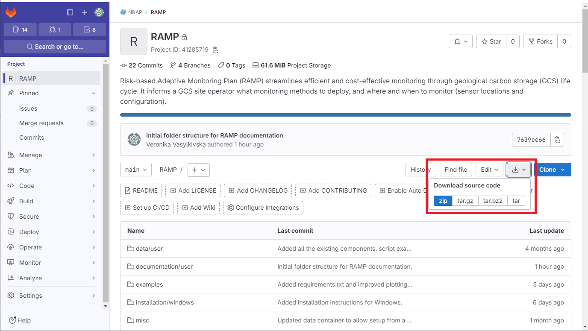
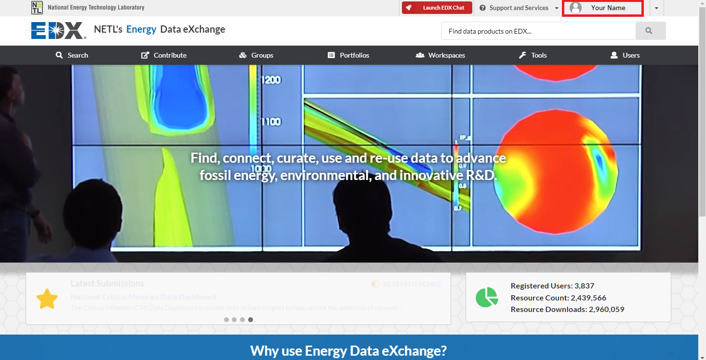
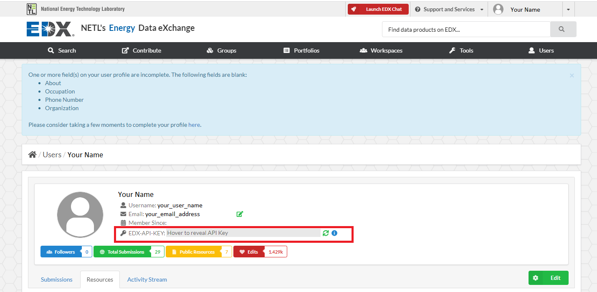
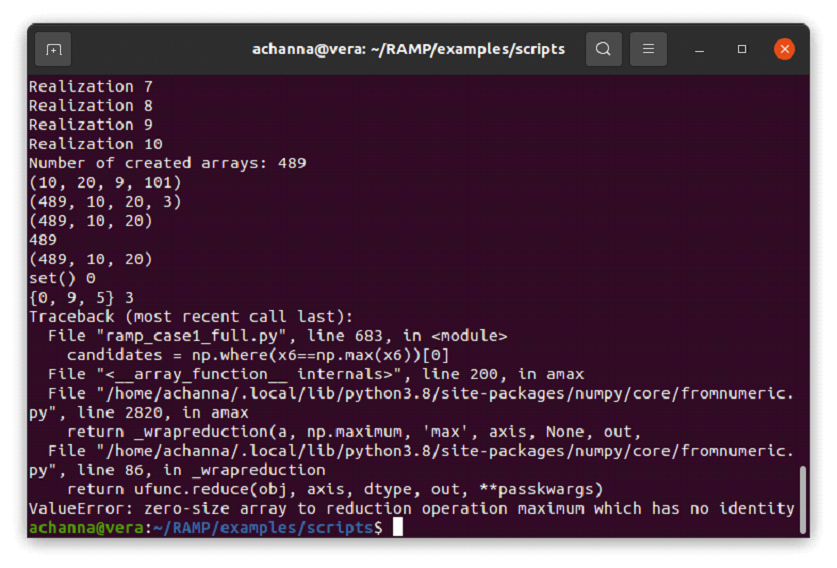
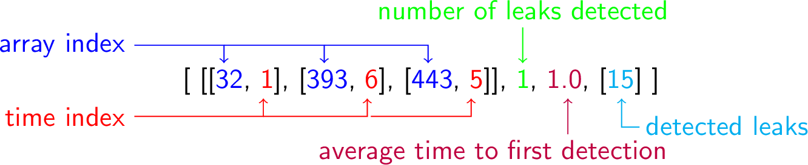

**********
Use Case 1
**********

.. toctree::

Welcome to the installation guide for Use Case 1 of the Risk-based Adaptive
Monitoring Plan (RAMP) software. This software is developed as part
of the National Risk Assessment Program (NRAP), an initiative by the
Department of Energy. Its primary function is to aid in the planning and
optimization of monitoring strategies for geologic carbon storage sites,
minimizing risks and costs associated with geologic carbon storage.
By considering potential CO2 leakage scenarios, RAMP provides a comprehensive
plan by determining ideal locations and timings for seismic surveys.

1. Download a copy of RAMP using one of the following methods

    * In the command line, enter ::

        git clone https://gitlab.com/NRAP/RAMP.git RAMP

    * Or login to GitLab using your credentials and go to https://gitlab.com/NRAP/RAMP,
      and click on the download button shown below.

2. Install Python, dependencies, and your preferred IDE (Integrated Development Environment)

    * In most Linux distributions, you can install the necessary dependencies
      using the following command line instructions::

        sudo apt update
        sudo apt upgrade
        sudo apt install python3 python3-pip
        pip3 install -r /RAMP/examples/scripts/requirements.txt

    * On Mac, install python and IDE using any of the following instructions

        https://www.python.org/downloads/macos/
        https://conda.io/projects/conda/en/latest/user-guide/install/macos.html
        https://docs.spyder-ide.org/3/installation.html

      Then use the following command to install dependencies::

        conda install --file RAMP/examples/scripts/requirements.txt

    * On Windows, install python and IDE using any of the following instructions,
      although there are many different equally effective ways to install Python on Windows

        https://www.python.org/downloads/windows/
        https://conda.io/projects/conda/en/latest/user-guide/install/windows.html
        https://docs.spyder-ide.org/3/installation.html

      Then use the following command to install dependencies::

    	conda install --file RAMP/examples/scripts/requirements.txt

      As an alternative, users of Windows OS can follow the instructions
      provided in the file *installation_instructions_Windows.txt*
      in the folder *installation/windows*.

3. Use your EDX credentials to login at https://edx.netl.doe.gov/user/login,
   then find your EDX key by clicking on your name in the upper right, then
   copy your EDX key from the field labelled EDX-API-KEY. Note that this key
   gives essentially the same access as having your username and password,
   so take care not to email it broadly or post it anywhere publicly visible,
   especially if your EDX account has access to sensitive data.

4. Navigate to the working directory *RAMP/examples/scripts*. If using a Linux terminal,
this will involve the commands "cd" and "ls" to navigate directories. If using a Windows
cmd terminal, this will instead involve "cd" and "dir". If using a Python Integrated
Development Environment (IDE) such as Spyder or PyCharm, use the appropriate menu interface
to define the current working directory.

5. Edit the *inputs.json* or *inputs.yaml* file in order to modify
   various variables controlling the way the optimization script runs.

    a.	Change the “edx_api_key” variable to your EDX key. Take care to remove
        the EDX key later if sharing the *inputs.json* file with other users.

    b.	Edit the next four true/false variables, labelled “download_data”,
        “process_data”, “run_optimization” and “plot_results”, to specify
        whether you want all those steps run. For example, once you've downloaded the data,
        you can probably set “download_data” to false on subsequent runs.
        Once the original seismic data is processed into NRMS values you can set
        "process_data" to false. Once you've run the optimization successfully
        and are happy with the results but want to edit the plotting codes,
        you can probably set “run_optimization” to false on subsequent runs.

    c.	Leave “data_case” equal to 1, in later versions there may be other
        data cases available to work with.

    d.	Define the number or list of leakage scenarios to include
        in the optimization. Currently you can simply specify a single number X
        and the script will use all leakage scenarios 1 through X. You can also
        use a dash to specify a range, X-Y will use all leakage scenarios
        from X to Y. You can also use commas to specify an irregular list
        of leakage scenarios, eg  “1,5,9,23,24,25”

    e.	Define the directories where you'd like the various leakage scenarios,
        intermediate NRMS files and output files stored using the parameters
        “directory_seismic_data”, “directory_velocity_data”,
        “directory_nrms_data” and “directory_plots”. For these parameters, you can 
        specify relative paths, for example by simply using a period . to indicate
        the current working directory, or ../ to indicate the directory above the
        current directory, or ./outputs to indicate a directory called outputs
        within the current directory. If running from a terminal, the current directory
        is the directory where you defined or navigated to in Step 4.

        You can also specify absolute paths, which in Linux will require a format 
        similar to /home/your_username/Documents/ramp-test, but in Windows will
        require a format similar to C:\\Users\\your_username\\Documents\\ramp-test

    f.	Define the list of potential source locations you'd like to consider
        in the optimization. You can specify an irregular list of values
        using the “sources” parameter, or you can design a set of evenly
        spaced potential sources using the “sourceNum”, “sourceMin” and
        “sourceMax” variables. If the “sources” variable is defined,
        it overrides the “sourceNum”, “sourceMin” and “sourceMax” variables.

    g.	Define the list of potential receiver locations using the same approach.

    h.	Define the seismic total duration using the “seismic_total_duration” variable.

    i.	Define the seismic sampling interval using
        the “seismic_sampling_interval” variable.

    j.	Define the NRMS threshold using the “threshold_nrms” variable.

    k.	Define how many time-steps you would like to include in each stage
        of the 3-stage optimization process using the “stage1”
        and “stage2” variables.

    l.	Define the number of monitoring plans you'd like to choose
        from using the “number_proposals” variable. While the optimization
        generates many thousands of potential monitoring plans, this limits
        the volume of information thrown at the user by narrowing it down
        to a set number of proposed monitoring plans.

6. Run the optimization using the following command, depending on which
   input file you chose to edit. Depending on your python installation,
   you may need to use "python" instead of "python3" in this command::

    python3 ramp_case1_full.py inputs.json

   or ::

    python3 ramp_case1_full.py inputs.yaml

   If you are using a visual IDE (e.g., Spyder or PyCharm) to run python,
   there may be a more complex and environment-specific way of running
   a python script with argument variables. A few examples are provided at these links:

    https://qbi-software.github.io/Python-tutorial/lessons/1-scripting.html

    https://www.jetbrains.com/help/pycharm/run-debug-configuration-python.html

   If you get the following error, it likely means that something
   is wrong with your EDX key::

       Traceback (most recent call last):
       File "C:\development\RAMP\examples\scripts\ramp_case1_full.py", line 214, in <module>
       resources = json_data['result']['resources']
       KeyError: 'result'

   If you get the following error, it likely means that the number of simulations
   you selected is incompatible with the length of the various stages you defined,
   meaning that by the time your “stage 3” of the optimization begins,
   there are no remaining leakage scenarios to attempt to detect.

The output files are exported in JSON, YAML and binary formats. They use a hierarchical, nested dictionary format, and the JSON and YAML files can be read manually.

The full output file includes a list of the seismic arrays available to the algorithm, with each being assigned a number that is referred to later in the output file. Each seismic array specifies the number of receivers, the list of receivers included in the array (as index numbers), and the index number for the source. The monitoring plans generated by the algorithm are then listed. The monitoring plans are organized into three stages, with each stage being made up of a list of monitoring plans.

The summary output file includes all monitoring plans ever constructed by the algorithm, which
can be unwieldly. Therefore a summary output file is also generated
which only includes a limited number of the best monitoring plans.
The user can define how many monitoring plans in the inputs file
(suggested 3-5 options).

The summary output file includes the list of only the seismic arrays
included in the monitoring plans, where each seismic array specifies
the number of receivers, locations of the receivers, and location
of the source. The list of monitoring plans are labelled and organized
into 3 stages, with the monitoring plans for each stage including
the arrays and deployment times, the number of leakage scenarios detected,
the list of particular scenarios detected, and the average time to detection.

  * stage 1

      * plan 1
  
          * deployment 1
          * deployment 2
          * deployment 3

      * plan 2
      
      * plan 3
  * stage 2
      * plan 1
  * stage 3
      * plan 1

Each monitoring plan includes a list of seismic arrays and their timesteps when they are deployed, the number of leaks detected, the average time to first detection, and the list of detected leaks.

   

********************************
Use Case 1 Wellbore Measurements
********************************

The next version of Use Case 1 designs optimal networks of wellbore-installed
sensors such as pore pressure and CO2 saturation

This version uses a similar approach as earlier, using a json or yaml file to
store the user-defined variables. As with previous use case follow
the following instructions to run it:

1. Navigate to the working directory *RAMP/examples/scripts*.

2. Edit the "inputs_wellbore.yaml" file in order to modify
   various variables controlling the way the optimization script runs.

    a. the edx key

    b. boolean values "download_data", "run_optimization", and "plot_results",
       which define which steps the user wants the script to run at this time.
       For example, if the leakage scenario data has already been downloaded,
       then "download_data" can be switched to false and that step will be skipped
       in subsequent runs.

    c. the directory paths are defined by:

        * "directory_simulation_data", which defines where the leakage scenario
          dataset is to be stored

        * "directory_output_files", which defines where the output files
          from the optimization are stored

        * "directory_plots", which defines where the various output charts
          and graphs are stored

    d. "max_sensors", which defines how many sensors the algorithm can deploy

    e. "max_wells", which defines how many monitoring wells the algorithm can deploy,
       where multiple sensors can be installed in a single well

    f. "scenarios", which defines which of the provided leakage scenarios
       should be used in the analysis

    g. "threshold_co2", which defines the detection threshold for CO2 saturation
       sensors, or the magnitude of CO2 saturation which can be considered a detection
       rather than simple background noise

    h. "number_proposals", which defines the number of proposals that should
       be presented to the user in the summary files

3. Update the environment used for RAMP (whether it's through Anaconda
   or command line) by adding an additional library needed for this use case
   by running::

    python -m pip install tqdm

4. Run the optimization using the following command. Depending on your python installation,
   you may need to use "python3" instead of "python" in this command::

    python ramp_wellbore_dynamic.py inputs_wellbore.yaml

Rather than re-evaluating the monitoring plan at several user-specified timesteps,
this approach re-evaluates the monitoring plan at each timestep, retaining
any monitoring wells that were already drilled in earlier timesteps
as those costs are already sunk.

This algorithm also uses three objectives rather than the two used in the original
use case 1:

1. Number of leaks detected (maximize)

2. Average time to first detection (minimize)

3. Average time to drilling wells (maximize)

The third objective is added in this use case, and under all conditions being equal
the optimization attempts to simulate well drilling as late in the monitoring plan
as possible in order to leave some flexibility to change the monitoring plan
in later timesteps.

Another change of this optimization approach is that the set of potential leakage
scenarios itself changes over time. This is because in a real use-case,
one might start with a list of potential leakage scenarios for a particular site,
but then as the years go on the history matching algorithms or understanding
of the field site may evolve, leading to new scenarios of concern.

Therefore, if the user specifies n leakage scenario files in the input file,
the algorithm randomly selects a set of n/2 leakage scenarios, and uses those
to develop a set of monitoring plans starting from the first timestep. These
monitoring plans represent every possible Pareto-optimal permutation
of wellbore sensors.

Then the algorithm advances to the next timestep, randomly selects a few more
of the leakage scenarios to add to the list, retains any monitoring wellbores
and sensors already installed in the previous timestep, and considers
every possible permutation of wellbores and sensors to add to the monitoring plan.

In this way, the algorithm has to deal with a bit of a moving target,
leaving some flexibility in place to make changes to the monitoring plan
as time goes on.

The outputs of the optmization are organized as a list of stages,
where each stage corresponds to a timestep.

At each stage, a list of monitoring plans are defined, a list of index values
is returned specifying which of those monitoring plans are Pareto-optimal
in terms of the three objectives. Additionally, a list of index values is returned
specifying which leakage scenarios the algorithm was aware of at that point in time.

Each monitoring plan is made up of a set of deployments, and a set of detections.
The deployments represent wellbore sensors installed at a particular place
(x, y, z) and time. The detections are index values representing which of
the various leakage scenarios are detected by this particular combination
of wellbore sensors.

Each deployment is made up of a timestep value, a wellboreSensor,
and a geophysical array. The geophysical array portion is currently under development.
The wellbore sensor defines an i, j, k location for the sensor, and a sensor
type such as pressure or CO2 saturation.

stages

	-> monitoring plans

		-> deployments

			-> timestep

			-> array

			-> wellbore sensor

		-> detections

	-> pareto

	-> iReals

********************************
Use Case 1 Wellbore plus Seismic Measurements
********************************

The output files of the wellbore point sensor plus seimsic optimization first includes
the list of timesteps for point sensors (which is distinct from seismic timesteps), under
the name "point_time_days", with each time index showing the corresponding time in days.

Next the list of input seismic arrays is shown, representing the set of building blocks that the 
optimization has to work with. Each seismic array is identified by an index
number, and includes the number of receivers (num_receivers), the list of receiver indicces
under the name "receivers", and the source index.

Once the arrays are defined by reference using indicces, the actual physical coordinates of
those indicces are defined under "seismic_receiverLocation_meters" and "seismic_sourceLocation_meters".
For each index, a set of three floating point numbers are listed, representing x, y, and z coordinates.

The set of timesteps particular to the seismic dataset is then defined under "seismic_time_days", 
with each time index showing the corresponding time in days.

After that a list of stages are defined. At each stage, a list of monitoring plans are defined ("plans"),
and a list of index values ("pareto") is returned specifying which of those monitoring plans are Pareto-optimal
in terms of the three objectives. Additionally, a list of index values ("iReals") is returned
specifying which leakage scenarios the algorithm was aware of at that point in time.

Each monitoring plan is made up of a set of wells, a set of arrays, and a list of indicces
representing the scenarios detected by that combination of point sensors and seismic surveys.

Under the list of wells, each well includes the i and j coordinates of the wellhead, the depth drilled,
the timestep (ie index value, not day or year) when the well is drilled, and the list of sensors installed.
Each sensor includes the depth (as an index value k, not meters) within the well at which it is located, the timestep of installation, and the type of sensor, such as pressure or saturation.

Under the list of arrays, each array is defined using an index of which input array it refers to ("iArray"), and the timestep
at which the survey was done ("survey_timestep").

point_time_days
seismic_arrays
    -> num_receivers
    -> receivers
    -> source
seismic_receiverLocation_meters
seismic_sourceLocation_meters
seismic_time_days
stages
	-> iReals
	-> pareto
    -> plans
		-> wells
            -> depth
			-> drill_timestep
            -> sensors
                -> install_timestep
                -> k
                -> type
        -> arrays
            -> iArray
            -> survey_timestep
   		-> detections
