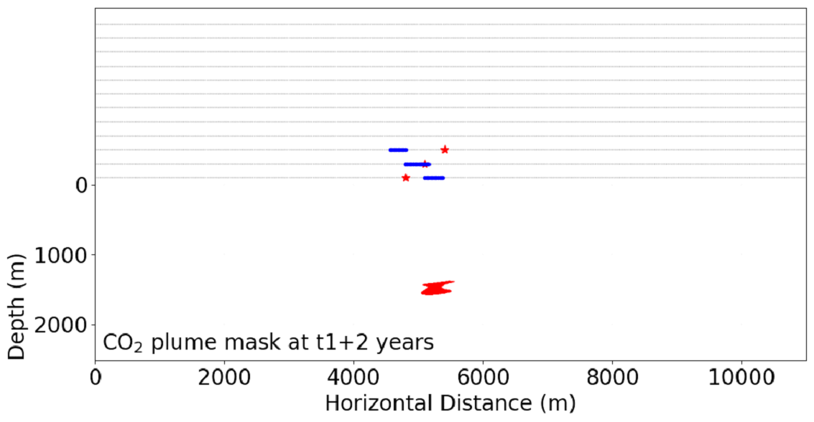

**********
Use Case 2
**********

.. toctree::

This section describes  installation guide for Use Case 2 of the Risk-based Adaptive
Monitoring Plan (RAMP) software.

1. Download a copy of RAMP and install required packages for RAMP following steps
   1 and 2 of the chapter Use case 1. As an alternative, users of Windows OS
   can follow the instructions provided in the file *installation_instructions_Windows.txt*
   in the folder *installation/windows*.

2. Navigate to the working folder *src/ramp/optimize*.

3. Edit configuration file *seis_sens_opt_params.yaml* in order to modify
   various variables controlling the way the optimization script runs.

4. The configuration file contains parameters of seismic simulation setup,
   optimization settings and choices of output data and images. This is
   the default YAML input file::

    source:
      # Number of sources
      ns: 146
      # Source interval (m)
      ds: 75.0
      # Year when fault leakage begins
      t1: 78

    receiver:
      # Number of receivers
      nr: 1467
      # Receiver interval (m)
      dr: 7.5

    output:
      # flag to control whether or not to plot sensitivity vs
      # "data to collect" plots
      dtc_flag: 1
      # flag for yaml file output, set as 1
      # to use yaml format output, 0 for text file
      output_yaml: 1
      # Root directory path for output
      outpre: ./output/
      # User defined data to collect percentage
      target_dtc: 5

    input:
      # Directory path for data
      datadir: ./example_data/
      # flag to use "segy" format, 0 to read data
      # from bin files directly
      segy_read: 1

    sensitivities:
      # flag to control the normalization of the sensitivity
      sen_norm: 1
      # List of years for monitoring
      years: [80, 85, 90, 95, 100, 125]
      # Maximum sensitivity values
      senMax: [1e7, 1e7, 1e7, 1e9]
      # contour values for sensitivity
      contour_values: [0.2, 0.6]
      sens_threshold: 0.90
      # downsample factor for sources
      ks: 4
      # downsample factor for receivers
      kr: 4
      # wavefield of the seismic wave
      wavefield: ['P', 'S']
      # velocity type
      vpvs: ['Vp', 'Vs']
      # units used for model plot
      units: {'vp': '(m/s)', 'vs': '(m/s)', 'density': '(kg/m$^3$)'}

5. An output directory defined in the YAML input file will be created
   to store output data and images. The output directory consists of several
   subdirs for time-lapse CO2 plume models, baseline velocity models,
   sensitivity images, and optimal seismic monitoring design. The optimal design
   is saved in both YAML ASCII files and PNG image files. This is an example of
   a monitoring design showing three source and variable receiver locations::

    4800.0:
    - 5100.0
    - 5130.0
    - 5160.0
    - 5190.0
    - 5220.0
    - 5250.0
    - 5280.0
    - 5310.0
    - 5340.0
    - 5370.0
    5100.0:
    - 4800.0
    - 4830.0
    - 4860.0
    - 4890.0
    - 4920.0
    - 4950.0
    - 4980.0
    - 5010.0
    - 5040.0
    - 5070.0
    - 5100.0
    - 5130.0
    - 5160.0
    5400.0:
    - 4560.0
    - 4590.0
    - 4620.0
    - 4650.0
    - 4680.0
    - 4710.0
    - 4740.0
    - 4770.0
    - 4800.0

6. A user must not change source and receiver parameters in the YAML which
   are meta data for the sensitivity data. The following parameters will
   impact the test output:

    * outpre defines the output directory

    * target_dtc is a threshold for percentage of data to collect. Total amount
      of data corresponds to the number of source-receiver pairs
      in the sensitivity data. RAMP will output seismic monitoring design
      corresponding to target_dtc.

    * sens_threshold is a fraction of maximum normalized sensitivity strength.
      It is a key parameter for optimal seismic monitoring design. A value of 0
      results in no data collection and 1 for collecting a complete data set
      without optimization. An optimal design is found by trading off between
      percentage of data to collect (cost) and sensitivity strength
      (detectability). A plot in sens_dtc folder shows the relationship
      between these two parameters.

7. Run the monitoring design script *sensitivity_optimization.py* from a terminal
   or command prompt using the following command::

    python sensitivity_optimization.py --config path_to_custom_yaml_file.yaml

   or ::

    python sensitivity_optimization.py

   In the last case *seis_sens_opt_params.yaml* will be used as default input file.
   The Python script *sensitivity_optimization.py* is located in the folder
   src/ramp/optimize.
